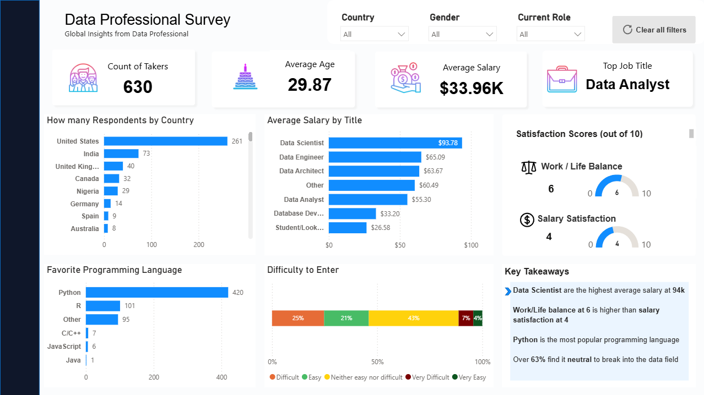

# Data Professional Survey Dashboard

## 📊 Dashboard Preview

## 🎯 Project Overview
This project is an enhanced data visualization built in Power BI using global survey data from over 600 data professionals. Taking foundational project data, I completely redesigned the layout, color palette, and chart selections to create a polished, corporate-ready analytical deliverable.

## 🛠️ Key Enhancements & Design Choices
* **Optimized Layout:** Changed vertical bar charts to horizontal layouts to eliminate text truncation on long labels (e.g., job titles and difficulty scales).
* **Survey Scale Alignment:** Hardcoded gauge boundaries to precisely match the survey's 10-point scale, preventing misleading dynamic scaling.
* **Proportional Analysis:** Engineered a compact 100% stacked bar chart with forced overflow percentages to display market entry difficulty accurately.
* **Executive Summary:** Integrated a dedicated "Key Takeaways" section highlighted with bold metrics for rapid skimming.

## 🔑 Key Insights
* **Data Scientists** command the highest average salary at **$94k**.
* **Work/Life balance (6/10)** scores significantly higher than overall **salary satisfaction (4/10)**.
* **Python** reigns supreme as the most popular programming language among respondents.
